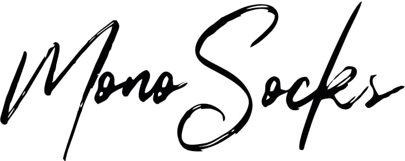
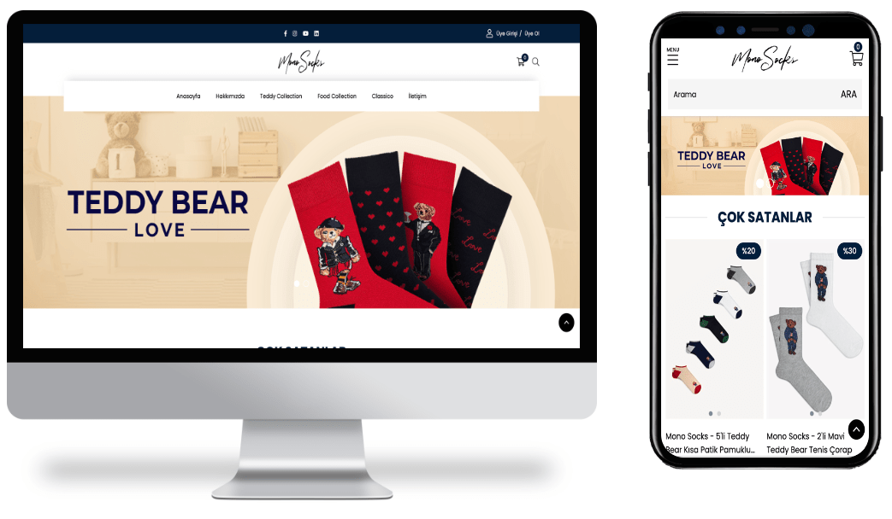
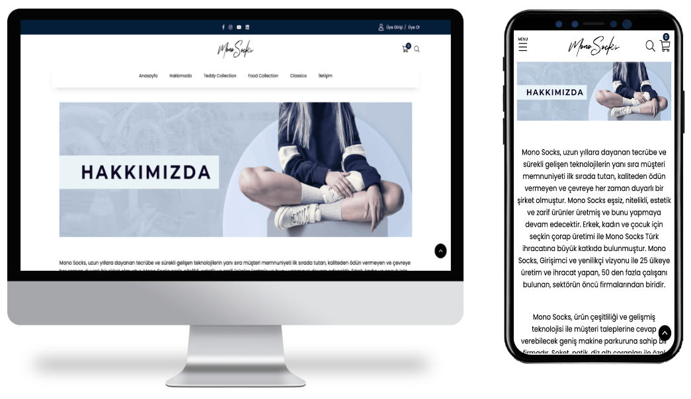
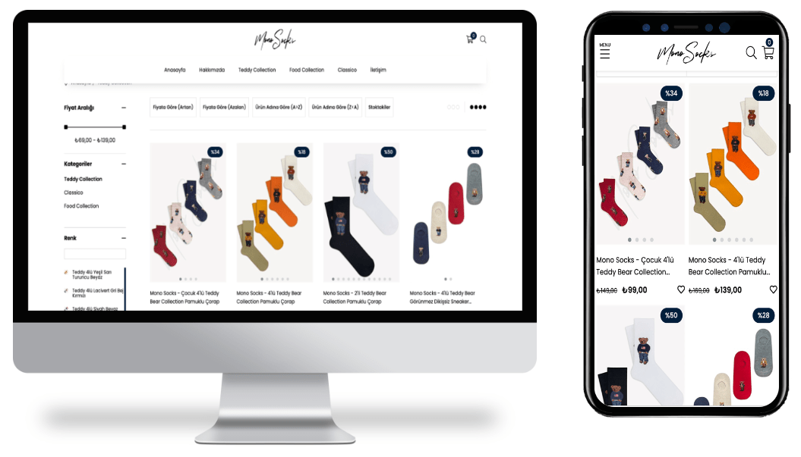
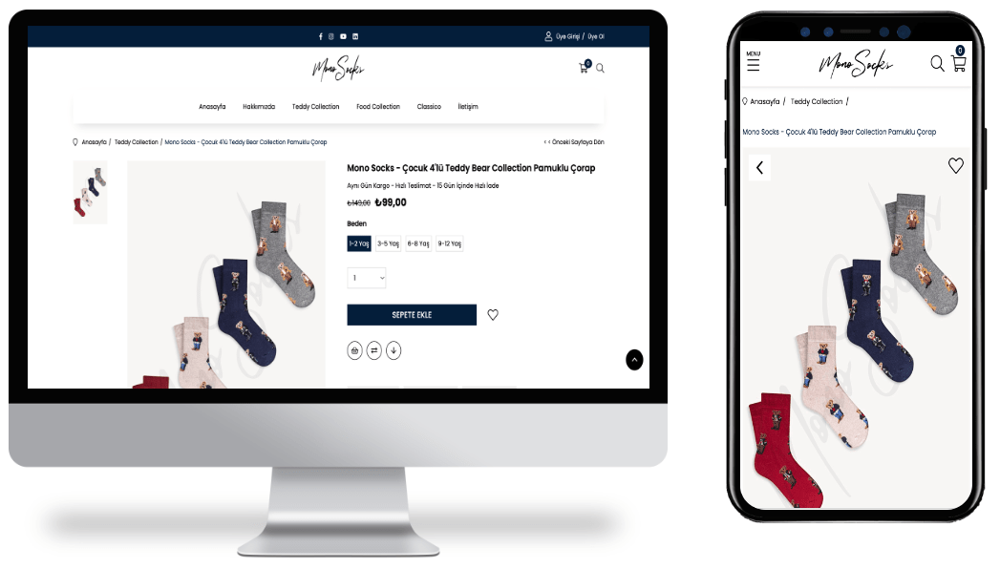

<div align="center">
  
</div>

##  About The Project

```html
<!-- HTML Meta Tags -->
<meta charset="UTF-8">
<meta name="viewport" content="width=device-width, initial-scale=1, maximum-scale=1">
<meta name="author" content="Sinan Özçelik">
<meta name="publisher" content="VS 2023">
<!-- Web Site Title -->
<title>Mono Socks</title>
<!-- Meta Open Graph -->
<meta property="og:locale" content="tr_TR" />
<meta property="og:type" content="website" />
<meta property="og:title" content="Anasayfa" />
<meta property="og:url" content="https://www.monosocks.com.tr/" />
<meta property="og:site_name" content="Mono Socks" />
```

##  Build With


## 💻 Project View







